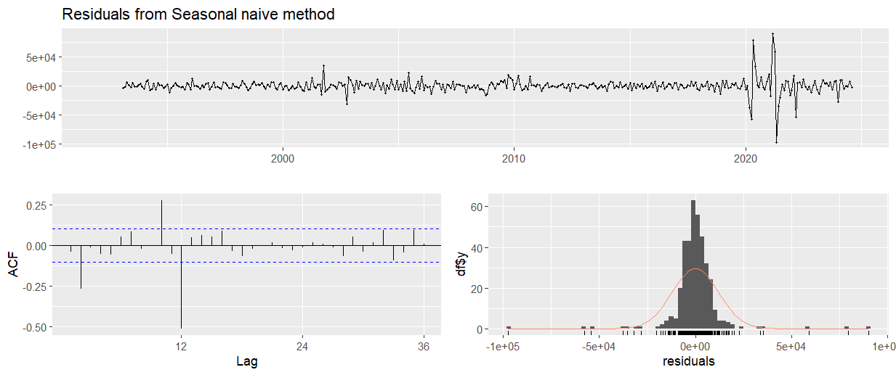
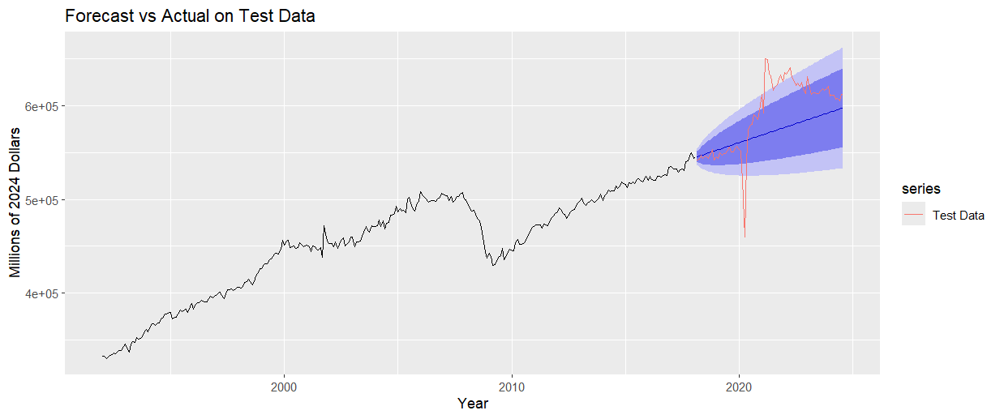
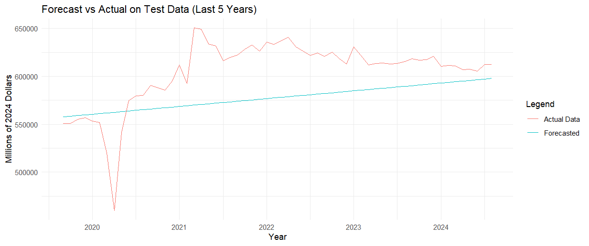

# Retail Sales Forecasting

## Project Overview

Forecasting retail sales is crucial for businesses, policymakers, and economists alike, as it helps gauge the health of consumer spending—a key driver of the US economy. This study was motivated by the unprecedented disruptions caused by the COVID-19 pandemic, which threw economic forecasts into uncertainty. Retail sales, in particular, faced sharp declines and rapid recoveries, leaving a gap in understanding how resilient long-term economic patterns truly are.

In this project, we applied various time series forecasting models to US monthly retail sales data, focusing on how quickly the economy returned to predicted patterns after such a severe shock. The most surprising finding was the **resilience of the long-term retail sales trends**. Despite the significant disruptions caused by COVID-19, our analysis using the ARIMA model revealed that the economy's underlying structure allowed retail sales to eventually realign with pre-pandemic forecasts. This showcases the robustness of the US retail market, even in the face of temporary disturbances.

Through this analysis, we demonstrate the value of using advanced forecasting methods, such as ARIMA and ETS, to capture complex economic trends. This project not only provides insights into forecasting retail sales but also highlights the power of long-term economic stability.

## Data
The retail sales data used in this analysis comes from the **FRED Advanced Retail Sales dataset**, spanning from 1992 to 2024. The raw data has been adjusted for inflation using the **CPI Index** from the **Bureau of Labor Statistics** to represent figures in **2024 million US dollars**. This adjustment ensures the values are consistent in real terms over time.

The dataset is stored in the `data` directory of this  repository and can be downloaded [here](data/retail_sales.csv).

The retail sales data, adjusted for inflation, covers the period from 1992 to 2024. Below is a visualization of the adjusted real retail sales, showing the general trend over time.

## Preprocessing
To make the data stationary, a first difference was applied to the real retail sales data. This transformation removes the long-term trend, allowing the models to focus on short-term fluctuations. The de-trended data is shown below:

## Seasonal Patterns

In the preprocessing step, seasonality in the retail sales data was examined. Both the `ggseasonplot()` and `ggsubseriesplot()` functions were used to identify persistent seasonal patterns in the data, as shown in the following plots. Given the strong seasonal behavior, no attempts were made to remove seasonality, as it plays a key role in retail sales forecasting.

### Seasonal Plot:
The `ggseasonplot()` visualizes the seasonal changes in retail sales across multiple years, clearly indicating consistent peaks and troughs in certain months.

### Subseries Plot:
The `ggsubseriesplot()` further highlights the monthly breakdown, showing how sales behave during specific months across different years, reinforcing the presence of persistent seasonality.

## Key Models

To forecast retail sales, we tested three different time series models, each offering unique For full numerical outputs, including error metrics and diagnostic tests, please refer to the [R Markdown file](sales_forecasting_analysis_fpp2.Rmd) in the repository.

1. **Seasonal Naive Model (SNaive)**: Provides a simple benchmark for comparison by assuming that future values will repeat past seasonal patterns without accounting for trends or fluctuations.

The Seasonal Naive model, with a high RMSE of 12054.12 and significant residual autocorrelation, indicates poor predictive accuracy. While simple to implement, the model fails to capture trends or changes in the underlying data, making it unsuitable for accurate forecasting. Its performance serves as a baseline for comparison, but the high errors and autocorrelation suggest it is inadequate for complex time series like retail sales.

2. **ETS Model**: Captures both trend and seasonal components effectively, making it suitable for data that exhibits consistent seasonality and growth or decline over time.

.png) 

The ETS model (ETS(M,A,N)) shows a considerable improvement over the SNaive model, with a lower RMSE of 7902.22 and a lower degree of residual autocorrelation, though some remains. The model effectively captures trends in the data through its smoothing parameters, but the significant p-value from the Ljung-Box test suggests that the model could still improve in accounting for some patterns. Overall, this model balances simplicity and predictive power, but it may underperform in the presence of unexpected fluctuations.

3. **ARIMA Model**: A more flexible model that captures both short-term and long-term dependencies in the data, particularly suited for predicting long-term retail sales, especially in the post-pandemic period.

(1,1,2)[12].png)

The ARIMA(1,1,0)(1,1,2)[12] model demonstrates the best fit, with the lowest RMSE of 7746.13 and minimal residual autocorrelation, making it the most robust for forecasting retail sales. It effectively handles both trend and seasonal variations, although the Ljung-Box test still shows some remaining autocorrelation. Given its flexibility and ability to capture complex data patterns, the ARIMA model is the most reliable choice for this dataset.

## Key Results

### Model Evaluation

- **SNaive Model**: Serves as a benchmark but lacks sophistication. It’s easy to implement but doesn’t adapt to trends or seasonality as well as the other methods.
- **ETS Model**: Performs better, adjusting for seasonality and trend. It has the lowest residual standard deviation, meaning it fits the data well in terms of in-sample error, but its out-of-sample predictive power is limited.
- **ARIMA Model**: Despite having a slightly higher residual standard deviation than ETS, ARIMA performs best for predictive accuracy. It captures more complex patterns, including seasonality and autocorrelation, making it the strongest model for forecasting future values.

### 24-Month Ahead Forecast
Using the ARIMA model, a 24-month ahead forecast was generated to predict retail sales into 2026. This projection assumes that the underlying patterns (trends, seasonality, and autocorrelation) observed in the past will continue into the future. While the model captures historical patterns effectively, it’s important to note that future economic conditions, such as policy changes or unexpected events, may affect the actual outcomes.

Despite these uncertainties, the ARIMA model's ability to capture complex patterns in the data provides a reasonable basis for future forecasts. Below is the graph showing the 24-month forecast:

(1,1,2)[12].png)

### Forecast Accuracy
The ARIMA model's forecast closely aligned with actual retail sales data, particularly during the period following COVID-19. This demonstrates the model's ability to predict long-term trends despite short-term economic disturbances.

### Training and Test Analysis
To assess the predictive power of the ARIMA model, the dataset was split into training and testing sets. The model was trained on the first part of the data and tested on the remaining portion to evaluate its out-of-sample forecast accuracy.

- **Training set**: Used for fitting the model.
- **Test set**: Used for evaluating the model's performance on unseen data.

The results indicate that the ARIMA model accurately predicted retail sales, particularly in the years following the COVID-19 disruption. Below is a zoomed-in graph showing how well the forecasted values aligned with the actual data over the last 5 years.

## Conclusion
This project demonstrates the resilience of long-term retail sales trends, even in the face of significant economic disruptions. For more details, please explore the full analysis in the R Markdown file.

## Instructions
1. Clone the repository.
2. Install the required R packages: `fpp2`, `ggplot2`, `forecast`.
3. Run the analysis in the R Markdown file `sales_forecasting_analysis_fpp2.Rmd`.

For a detailed breakdown of the analysis, refer to the [R Markdown file](`sales_forecasting_analysis_fpp2.Rmd`), which contains the full code, explanations, and insights into the models used.

