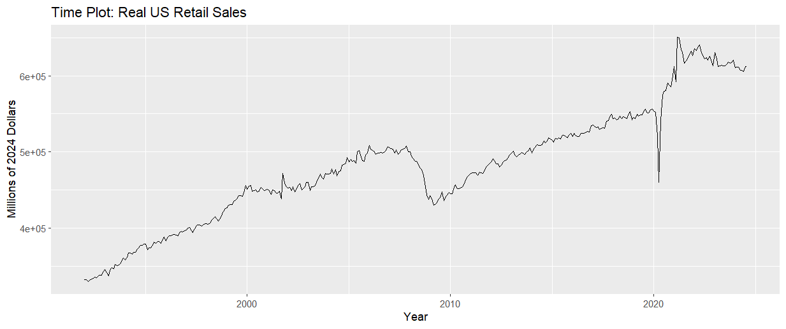
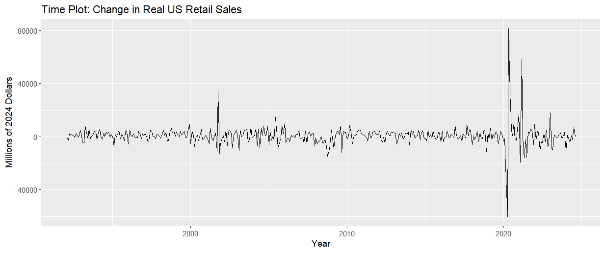
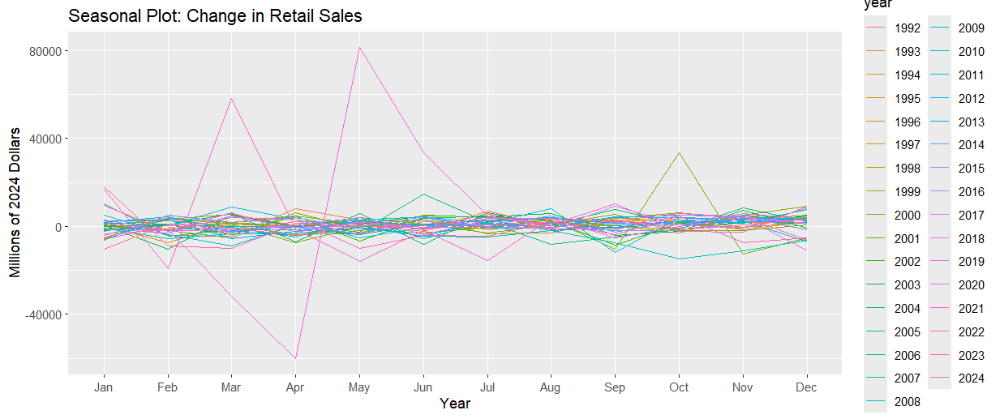
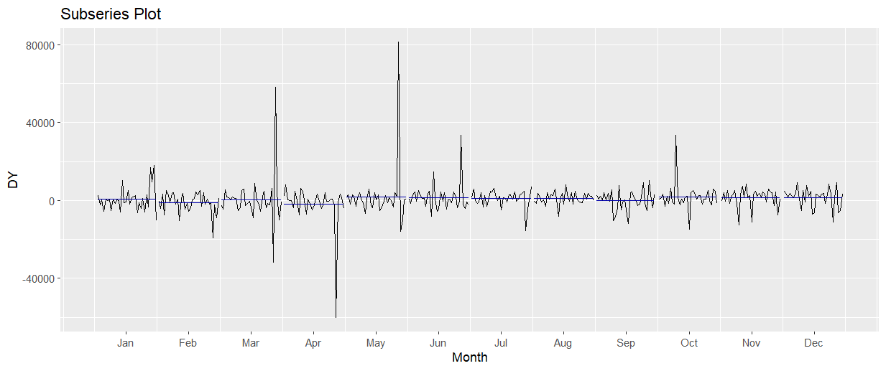

# Retail Sales Forecasting

## Project Overview

Forecasting retail sales is crucial for businesses, policymakers, and economists alike, as it helps gauge the health of consumer spending—a key driver of the US economy. This study was motivated by the unprecedented disruptions caused by the COVID-19 pandemic, which threw economic forecasts into uncertainty. Retail sales, in particular, faced sharp declines and rapid recoveries, leaving a gap in understanding how resilient long-term economic patterns truly are.

In this project, we applied various time series forecasting models to US monthly retail sales data, focusing on how quickly the economy returned to predicted patterns after such a severe shock. The most surprising finding was the **resilience of the long-term retail sales trends**. Despite the significant disruptions caused by COVID-19, our analysis using the ARIMA model revealed that the economy's underlying structure allowed retail sales to eventually realign with pre-pandemic forecasts. This showcases the robustness of the US retail market, even in the face of temporary disturbances.

Through this analysis, we demonstrate the value of using advanced forecasting methods, such as ARIMA and ETS, to capture complex economic trends. This project not only provides insights into forecasting retail sales but also highlights the power of long-term economic stability.

## Key Models

To forecast retail sales, we tested three different time series models, each offering unique strengths in capturing patterns and trends in the data:

1. **Seasonal Naive Model (SNaive)**: Provides a simple benchmark for comparison by assuming that future values will repeat past seasonal patterns without accounting for trends or fluctuations.
2. **ETS Model**: Captures both trend and seasonal components effectively, making it suitable for data that exhibits consistent seasonality and growth or decline over time.
3. **ARIMA Model**: A more flexible model that captures both short-term and long-term dependencies in the data, particularly suited for predicting long-term retail sales, especially in the post-pandemic period.

## Key Results
- The ARIMA model performed the best, demonstrating how retail sales trends returned to predicted values after the COVID-19 disturbances.
- ETS offered a reasonable performance but exhibited some residual autocorrelation.
- The SNaive model served as a useful baseline, but it lacked the sophistication to handle complex patterns in the data.

## Data
The retail sales data used in this analysis comes from the **FRED Advanced Retail Sales dataset**, spanning from 1992 to 2024. The raw data has been adjusted for inflation using the **CPI Index** from the **Bureau of Labor Statistics** to represent figures in **2024 million US dollars**. This adjustment ensures the values are consistent in real terms over time.

The dataset is stored in the `data` directory of this  repository and can be downloaded [here](data/retail_sales.csv).

The retail sales data, adjusted for inflation, covers the period from 1992 to 2024. Below is a visualization of the adjusted real retail sales, showing the general trend over time.

## Preprocessing
To make the data stationary, a first difference was applied to the real retail sales data. This transformation removes the long-term trend, allowing the models to focus on short-term fluctuations. The de-trended data is shown below:

## Seasonal Patterns

In the preprocessing step, seasonality in the retail sales data was examined. Both the `ggseasonplot()` and `ggsubseriesplot()` functions were used to identify persistent seasonal patterns in the data, as shown in the following plots. Given the strong seasonal behavior, no attempts were made to remove seasonality, as it plays a key role in retail sales forecasting.

### Seasonal Plot:
The `ggseasonplot()` visualizes the seasonal changes in retail sales across multiple years, clearly indicating consistent peaks and troughs in certain months.

### Subseries Plot:
The `ggsubseriesplot()` further highlights the monthly breakdown, showing how sales behave during specific months across different years, reinforcing the presence of persistent seasonality.

## Instructions
1. Clone the repository.
2. Install the required R packages: `fpp2`, `ggplot2`, `forecast`.
3. Run the analysis in the R Markdown file `sales_forecasting_analysis_fpp2.Rmd`.

For a detailed breakdown of the analysis, refer to the [R Markdown file](`sales_forecasting_analysis_fpp2.Rmd`), which contains the full code, explanations, and insights into the models used.

## Visualizations
- **Seasonal Plot**: Shows recurring seasonal trends in retail sales.
  
  
- **ARIMA Forecast Plot**: Displays the forecasted vs. actual retail sales, highlighting the post-pandemic recovery.
  

- **Residual Diagnostics**: Shows how well the ARIMA model fits the data through residuals analysis.
  

## Conclusion
This project demonstrates the resilience of long-term retail sales trends, even in the face of significant economic disruptions. For more details, please explore the full analysis in the R Markdown file.

